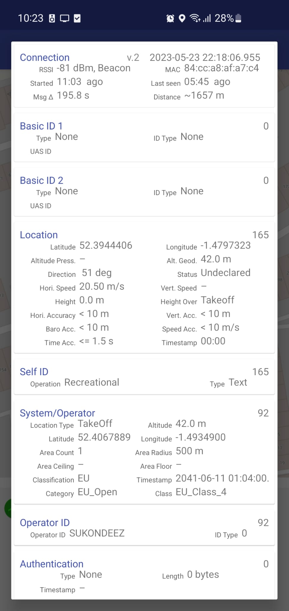

# RIDS - Remote ID Spoofer

An ESP8266/NodeMCU Drone RemoteID Spoofer.
Built based on work done by [sxjack](https://github.com/sxjack/uav_electronic_ids) and [SpacehuhnTech](https://github.com/SpacehuhnTech/esp8266_deauther).
I stand on the shoulders of giants.

This spawns 16 different fake drones broadcasting RemoteID, with them all flying in random directions around a particular GPS location.

Do check that whatever device you're using to detect the drones can sniff packets from the air fast enough.
If you're using OpenDroneID available on the App Store or Play Store, you'll have to disable scan throttling for your device, and run the app for ~5-10 minutes before all 16 drones are actually "in the air".

## Installation

1. You need the [Arduino IDE](https://www.arduino.cc/en/software).
2. Open the file `RemoteIDSpoofer/RemoteIDSpoofer.ino`.
3. In Arduino IDE, go to `File` > `Preferences`, then add this URL to the `Additional Boards Manager URLs`:
	- https://raw.githubusercontent.com/SpacehuhnTech/arduino/main/package_spacehuhn_index.json
4. Now go to `Tools` > `Boards` > `Boards Manager`, search `deauther` and install `Deauther ESP8266 Boards`.
5. Select your board at `Tools` > `Board` > and be sure it is at `Deauther ESP8266 Boards` (and not at `ESP8266 Modules`).
6. Plug in your device, I used a NodeMCU v2, and select its COM port at `Tools` > `Port`.
7. Press `upload`, or use Ctrl+U.
8. The device should start broadcasting RemoteID packets generated for random flying machines.

## Usage

1. After the installation steps, connect to the wireless access point `ESP_RIDS` using the password `makkauhijau` on any device, a smartphone will work well enough.
2. There, input your own GPS coordinates.
3. Start spoofing!

> If no GPS coordinates are used within 2 minutes of startup, the device will automatically go into spoofing mode and you will not be able to change the coordinates without a power cycle.

## Disclaimer

This repository and its code are intended for educational purposes only.
Neither the ESP8266, nor its SDK were meant or built for such purposes.
Bugs can occur!

It is also illegal to be broadcasting fake RemoteID packets in public airspace, in the same way that spoofing ADS-B packets is illegal.
Whatever manner you wish to use this on is at your own discretion, we don't take any responsibility for what you do with this software.
